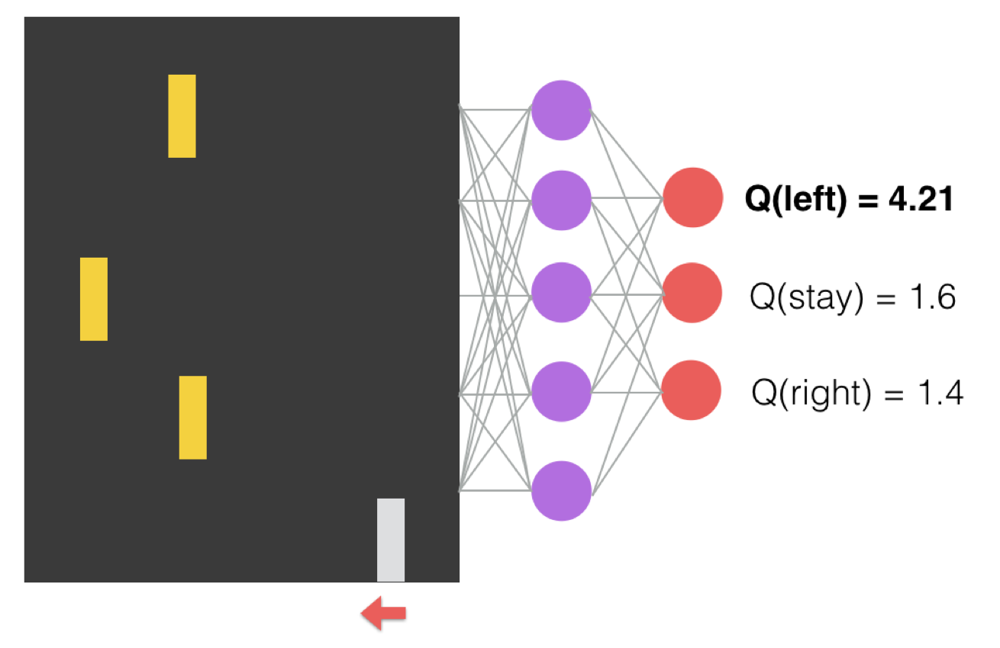
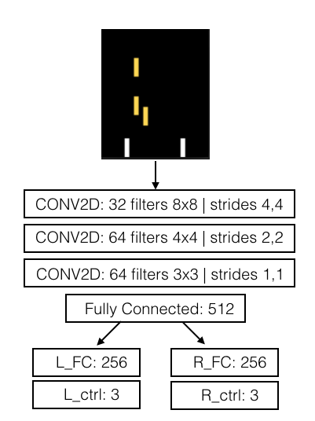
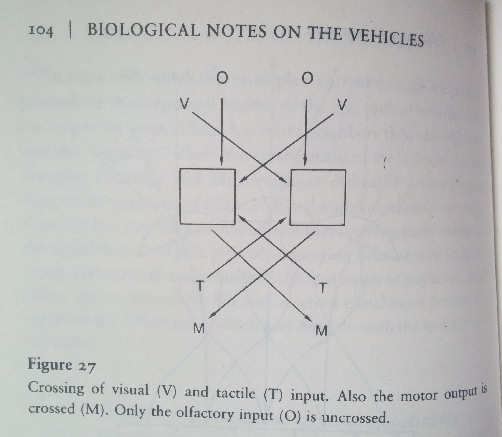
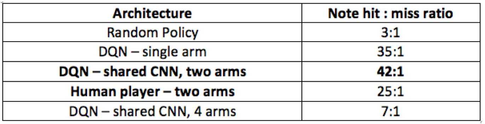

# Deep Q Networks for learned Bi-Manual and n-Manual robot control and coordination


## Overview

Meet Shimon, a 4-armed Marimba-playing improvising robot at the Georgia Tech Center for Music Technology!

The aim of this project is to develop a learned representation of Shimon's physical constraints for use in real-time musical improvisation. We implement an extension of DeepMind's Atari-playing Deep Q Network that approximates a simple Left-Right Motor Cortex of an animal brain. After training, the network learns bi-manual coordination in a virtual environment and out-performs a human at the same task. We are currently trying to generalize this process to n-manual coordination.


## Training
We design a simulator similar to Guitar Hero for Shimon robot:
* Grey arms represent Shimon's arms
* Descending yellow blocks correspond to notes that must be hit

The only signals available to the DQN agent are:
* A correctly hit note produces reward = +1
* A missed note produces reward = -1
* An arm collision causes terminal = true, (i.e game over)
* Raw pixels from the game

All behavior learned by the agent, including coordination of arms not to hit one another and catch notes on opposite ends of the screen, is learned through a Deep Q Network trained overnight on an NVidia Titan X Pascal GPU. 



## Architecture - Bimanual DQN
To account for all possible combination of notes and spatial relations of arms to each note, a CNN architecture fits very well for the task at hand. Our contribution lies in the investigation of "bi-manual control" and generalizations to n-manual control. Deep Reinforcement Learning has shown great promise in the field of robotics, however most of the implementations are limited tp "mono-manual" i.e a single robotic arm opening a door [], a single robotic arm stacking boxes [], a single robotic arm grabbing objects []. Bi-manual control requires coordination of dynamic and joined degrees of freedom.

We experimented with different architectures including:
* A DQN that outputs Q-values for all possible combinations of arm movements e.g 3 arms (27 combos: LLL, RLL, RRL, RRR etc...)
* A DQN that splits the screen into left half and right half, corresponding to the areas covered left and right arms
* A DQN in which the left arm queries the NN controlling the right arm, but instead flips the instruction as a mirror image.

The architecture achieving better-than-human results in bi-manual control is the following architecture. We branch out 2 separate FC layers for each arm. We reason that the shared activations from the CNN is useful for both left and right arms, but each arm must learn to interpret the signals in a separate manner. 



Interestingly, I finished reading a book on synthetic neurobiology "Vehicles" by Valentino Braitenberg. The author uses simple fictional vehicles to motivate the design of how animal sensory percepts and crossed connections between visual, audio and motor cortexes came to be.



The branching into left and right hemispheres mirrors the architecture we arrived in our experiments. We are currently exploring models

## Bi-manual control and coordination results




## 4-arm control and coordination
The Network is yet unable to generalize and coordinate 4 arms. Some local optimums include:
"Grouping the arms together to form 2 arms"\s\s


"Grouping all arms together to form one large arm"\s\s


## Q-learning 
For a detailed treatment on DQN and Deep Reinforcement Learning, refer to the [original DeepMind Atari DQN Paper](https://deepmind.com/research/publications/playing-atari-deep-reinforcement-learning/). The DQN model in this work is based on very well documented and explained blogs by [Ben Lau] (https://yanpanlau.github.io/2016/07/10/FlappyBird-Keras.html) and [Yen Chen Lin] (https://github.com/yenchenlin/DeepLearningFlappyBird).

## Work in Progress
* Continue to explore biologically inspired architectures in terms of visual and motor cortexes. 
* Implenting Curriculum Learning: Shimon progresses from "easy etudes" to harder musical passages like a musical student
* A3C for continuous control output and integration with time based models like LSTM's.
 
## Dependancies
To install the requirements used in this project, run the following command.
```
pip install -r requirements.txt
```
The main dependancies are:
* Python 3.5
* Keras 2.0.2
* Tensorflow 1.0.1
* Pygame 1.9.3

## Credits
* Deep Reinforcement Learning: Lamtharn (Hanoi) Hantrakul
* Shimon Hero Simulator: Zachary Kondak
* Advisor: Dr. Gil Weinberg
* Special thanks to Dr. Mason Bretan for insightful discussion and advice throughout the project. 
